# 7-Layer Copilot Reference Architecture

> **The foundational architecture pattern for enterprise Microsoft Copilot implementations**

---

## Overview

The 7-Layer Reference Architecture provides a comprehensive blueprint for building scalable, secure, and maintainable enterprise AI solutions with Microsoft Copilot. Each layer serves a specific purpose and can be independently scaled and secured.

---

## Architecture Diagram

```mermaid
graph TB
    subgraph "Layer 1: User Experience"
        A1[Microsoft Teams]
        A2[Web Chat]
        A3[Mobile Apps]
        A4[Email Integration]
        A5[Voice/Phone]
    end

    subgraph "Layer 2: Orchestration"
        B1[Copilot Studio<br/>Agent Management]
        B2[Semantic Kernel<br/>Custom Orchestration]
        B3[Power Automate<br/>Workflow Engine]
        B4[Conversation Manager]
        B5[State Management]
    end

    subgraph "Layer 3: Intelligence"
        C1[Azure OpenAI<br/>GPT-4]
        C2[Embedding Models<br/>text-embedding-ada-002]
        C3[Semantic Kernel<br/>Plugins & Functions]
        C4[Prompt Engineering<br/>Templates]
    end

    subgraph "Layer 4: Data & Knowledge"
        D1[SharePoint<br/>Documents]
        D2[OneDrive<br/>Personal Files]
        D3[Dataverse<br/>Structured Data]
        D4[Azure AI Search<br/>Vector Database]
        D5[SQL Database<br/>Enterprise Data]
    end

    subgraph "Layer 5: Integration"
        E1[Microsoft Graph API<br/>M365 Services]
        E2[Custom REST APIs<br/>Internal Systems]
        E3[Power Platform<br/>Connectors]
        E4[Azure Functions<br/>Serverless Logic]
    end

    subgraph "Layer 6: Security & Governance"
        F1[Entra ID<br/>Authentication]
        F2[Microsoft Purview<br/>Data Governance]
        F3[DLP Policies<br/>Data Protection]
        F4[Conditional Access<br/>Zero Trust]
        F5[Sensitivity Labels<br/>Classification]
    end

    subgraph "Layer 7: Monitoring & Observability"
        G1[Application Insights<br/>Telemetry]
        G2[Log Analytics<br/>Centralized Logging]
        G3[Azure Monitor<br/>Infrastructure]
        G4[Microsoft Sentinel<br/>Security Analytics]
        G5[Power Platform<br/>Admin Center]
    end

    A1 & A2 & A3 & A4 & A5 --> B1 & B2 & B3
    B1 & B2 & B3 & B4 & B5 --> C1 & C2 & C3
    C1 & C2 & C3 & C4 --> D1 & D2 & D3 & D4 & D5
    D1 & D2 & D3 & D4 & D5 --> E1 & E2 & E3 & E4

    F1 & F2 & F3 & F4 & F5 -.Security.-> B1 & B2 & B3
    F1 & F2 & F3 & F4 & F5 -.Security.-> C1 & C2 & C3
    F1 & F2 & F3 & F4 & F5 -.Security.-> D1 & D2 & D3 & D4 & D5
    F1 & F2 & F3 & F4 & F5 -.Security.-> E1 & E2 & E3 & E4

    G1 & G2 & G3 & G4 & G5 -.Monitoring.-> B1 & B2 & B3
    G1 & G2 & G3 & G4 & G5 -.Monitoring.-> C1 & C2 & C3
    G1 & G2 & G3 & G4 & G5 -.Monitoring.-> D1 & D2 & D3 & D4 & D5
    G1 & G2 & G3 & G4 & G5 -.Monitoring.-> E1 & E2 & E3 & E4

    style A1 fill:#0078D4,color:#fff
    style A2 fill:#0078D4,color:#fff
    style A3 fill:#0078D4,color:#fff
    style A4 fill:#0078D4,color:#fff
    style A5 fill:#0078D4,color:#fff

    style B1 fill:#50E6FF,color:#000
    style B2 fill:#50E6FF,color:#000
    style B3 fill:#50E6FF,color:#000
    style B4 fill:#50E6FF,color:#000
    style B5 fill:#50E6FF,color:#000

    style C1 fill:#00C896,color:#fff
    style C2 fill:#00C896,color:#fff
    style C3 fill:#00C896,color:#fff
    style C4 fill:#00C896,color:#fff

    style D1 fill:#FFB900,color:#000
    style D2 fill:#FFB900,color:#000
    style D3 fill:#FFB900,color:#000
    style D4 fill:#FFB900,color:#000
    style D5 fill:#FFB900,color:#000

    style E1 fill:#FF8C00,color:#fff
    style E2 fill:#FF8C00,color:#fff
    style E3 fill:#FF8C00,color:#fff
    style E4 fill:#FF8C00,color:#fff

    style F1 fill:#E81123,color:#fff
    style F2 fill:#E81123,color:#fff
    style F3 fill:#E81123,color:#fff
    style F4 fill:#E81123,color:#fff
    style F5 fill:#E81123,color:#fff

    style G1 fill:#8661C5,color:#fff
    style G2 fill:#8661C5,color:#fff
    style G3 fill:#8661C5,color:#fff
    style G4 fill:#8661C5,color:#fff
    style G5 fill:#8661C5,color:#fff
```

---

## Layer Details

### Layer 1: User Experience
**Purpose:** Multi-channel interfaces for user interaction

**Components:**
- **Microsoft Teams**: Primary enterprise chat interface
- **Web Chat**: Embedded website chatbot
- **Mobile Apps**: iOS and Android applications
- **Email Integration**: Outlook add-ins and email-based interactions
- **Voice/Phone**: IVR integration and voice interfaces

**Key Considerations:**
- Consistent UX across all channels
- Responsive design for mobile
- Accessibility (WCAG compliance)
- Branding and customization
- Session management across channels

**Technology Stack:**
- Teams apps (Adaptive Cards, Message Extensions)
- React/TypeScript for web
- Native mobile SDKs
- Power Virtual Agents for voice

---

### Layer 2: Orchestration
**Purpose:** Coordinate conversation flow, agent routing, and workflow execution

**Components:**
- **Copilot Studio**: Low-code agent builder and manager
- **Semantic Kernel**: Code-first orchestration framework
- **Power Automate**: Workflow automation engine
- **Conversation Manager**: Dialog management and turn handling
- **State Management**: Context and session persistence

**Key Patterns:**
- Single agent with topics (simple use cases)
- Multi-agent orchestration (enterprise use cases)
- Hybrid approach (Copilot Studio + custom code)
- Event-driven workflows
- Human-in-the-loop escalation

**Decision Logic:**
- Use Copilot Studio for: Conversational scenarios, rapid iteration, non-technical maintainers
- Use Semantic Kernel for: Complex orchestration, heavy customization, developer-owned solutions
- Use Power Automate for: Business process automation, approvals, system integration

---

### Layer 3: Intelligence
**Purpose:** AI capabilities including language understanding, generation, and reasoning

**Components:**
- **Azure OpenAI - GPT-4**: Primary language model for generation
- **Embedding Models**: Vector representations for semantic search
- **Semantic Kernel Plugins**: Reusable AI functions and skills
- **Prompt Templates**: Standardized prompts for consistency

**Key Capabilities:**
- Natural language understanding (NLU)
- Response generation with grounding
- Semantic search and retrieval
- Function calling and tool use
- Multi-turn conversation handling

**Best Practices:**
- Prompt engineering with clear personas and constraints
- Grounding responses in enterprise data
- Token optimization for cost management
- Response validation and safety checks
- Temperature and parameter tuning per scenario

**Cost Management:**
- Monitor token consumption (input + output)
- Implement caching for frequent queries
- Use smaller models where appropriate
- Set max tokens per request
- Track cost per user/department

---

### Layer 4: Data & Knowledge
**Purpose:** Enterprise data sources that ground AI responses

**Components:**
- **SharePoint**: Document libraries and knowledge bases
- **OneDrive**: Personal and team file storage
- **Dataverse**: Structured business data
- **Azure AI Search**: Vector search and indexing
- **SQL Database**: Transactional and analytical data

**Data Patterns:**
- **Grounding**: Retrieve relevant data before generation
- **RAG (Retrieval Augmented Generation)**: Semantic search + generation
- **Structured queries**: SQL for precise data retrieval
- **Hybrid search**: Combine keyword and vector search
- **Real-time data**: Direct API calls vs indexed data

**Data Quality Requirements:**
- Clean, well-structured data
- Proper metadata and tagging
- Regular index updates
- Data freshness SLAs
- Permissions aligned with source systems

**Security:**
- Honor source system permissions
- Encrypt data at rest and in transit
- Data classification and labeling
- Audit trail for data access
- PII detection and masking

---

### Layer 5: Integration
**Purpose:** Connect to internal and external systems

**Components:**
- **Microsoft Graph API**: Unified API for M365 services
- **Custom REST APIs**: Internal enterprise systems
- **Power Platform Connectors**: Pre-built and custom connectors
- **Azure Functions**: Serverless compute for custom logic

**Integration Patterns:**

**Synchronous (Real-Time):**
- Direct API calls during conversation
- Response time < 5 seconds
- Use for: User-specific data, current status checks
- Example: Check user's calendar availability

**Asynchronous (Background):**
- Trigger workflow, return ticket number
- Long-running processes
- Use for: Complex data processing, multi-step workflows
- Example: Generate comprehensive report

**Event-Driven:**
- External system triggers agent action
- Use for: Proactive notifications, monitoring
- Example: Alert user when approval needed

**Best Practices:**
- Implement retry logic with exponential backoff
- Circuit breaker pattern for failing services
- Rate limiting and throttling
- API versioning strategy
- Comprehensive error handling
- Health check endpoints

---

### Layer 6: Security & Governance
**Purpose:** Protect data, authenticate users, enforce policies

**Components:**
- **Entra ID (Azure AD)**: Identity and authentication
- **Microsoft Purview**: Data governance and compliance
- **DLP Policies**: Data loss prevention rules
- **Conditional Access**: Context-aware access control
- **Sensitivity Labels**: Data classification

**Zero Trust Principles:**
1. **Verify explicitly**: Always authenticate and authorize
2. **Least privilege access**: Minimal permissions required
3. **Assume breach**: Segment access, verify end-to-end

**Security Controls:**

**Identity Layer:**
- Multi-factor authentication (MFA)
- Passwordless authentication
- Single sign-on (SSO)
- Service principals for app authentication

**Device Layer:**
- Managed device requirement
- Device compliance policies
- Mobile Application Management (MAM)

**Application Layer:**
- App-specific permissions
- API permissions (delegated vs application)
- Token lifetime policies

**Data Layer:**
- Sensitivity labels (Public, Internal, Confidential, Restricted)
- Encryption at rest and in transit
- DLP policies (detect and block)
- Information Rights Management (IRM)

**Network Layer:**
- Private endpoints (no public internet)
- Virtual Network (VNet) integration
- Firewall rules
- Service endpoints

**Monitoring Layer:**
- Microsoft Purview for data governance
- Azure Sentinel for security analytics
- Audit logs with 1+ year retention
- Threat detection and alerts

**Compliance Frameworks:**
- GDPR (data privacy)
- HIPAA (healthcare)
- SOC 2 (service organization controls)
- ISO 27001 (information security)
- FINRA/SEC (financial services)

---

### Layer 7: Monitoring & Observability
**Purpose:** Track performance, usage, errors, and business metrics

**Components:**
- **Application Insights**: Application telemetry and performance
- **Log Analytics**: Centralized log aggregation
- **Azure Monitor**: Infrastructure and platform monitoring
- **Microsoft Sentinel**: Security information and event management
- **Power Platform Admin Center**: Agent usage and analytics

**Monitoring Dimensions:**

**Performance Metrics:**
- Response time (P50, P95, P99)
- Throughput (requests per second)
- Token consumption rate
- API latency by endpoint
- Resource utilization (CPU, memory)

**Usage Metrics:**
- Daily/monthly active users
- Conversations per user
- Most popular topics/intents
- Peak usage hours
- Adoption trends

**Quality Metrics:**
- Task completion rate
- Escalation to human rate
- User satisfaction (CSAT)
- Response accuracy
- Hallucination detection

**Error Metrics:**
- Error rate by type
- Failed API calls
- Timeout frequency
- Exception patterns

**Business Metrics:**
- Time saved per user
- Cost per conversation
- ROI tracking
- Business outcomes (tickets resolved, sales generated)

**Alerting Strategy:**
- **Critical**: P1 incidents (service down, security breach)
- **High**: P2 incidents (elevated error rate, performance degradation)
- **Medium**: P3 incidents (warnings, capacity thresholds)
- **Low**: P4 incidents (informational, trend alerts)

**Dashboards:**
1. **Executive Dashboard**: High-level KPIs, adoption, ROI
2. **Operational Dashboard**: Performance, errors, health
3. **Security Dashboard**: Threats, violations, audit logs
4. **Business Dashboard**: Usage by department, popular scenarios

---

## Architecture Principles

### 1. Modularity
**Principle:** Each layer should be independently deployable and scalable

**Benefits:**
- Update one layer without affecting others
- Scale layers independently based on load
- Replace components without full system redesign
- Enable parallel development across teams

**Implementation:**
- Well-defined APIs between layers
- Loose coupling via interfaces
- Avoid direct dependencies

---

### 2. Security by Design
**Principle:** Security is enforced at every layer, not added later

**Benefits:**
- Defense in depth (multiple security controls)
- Reduced attack surface
- Compliance from day one
- Easier auditing

**Implementation:**
- Authentication at Layer 1 (user experience)
- Authorization at Layer 5 (integration) - honor source permissions
- Data protection at Layer 4 (encryption, DLP)
- Monitoring at Layer 7 (audit logs, alerts)

---

### 3. Observable by Default
**Principle:** All components emit telemetry and logs automatically

**Benefits:**
- Faster troubleshooting
- Proactive issue detection
- Data-driven optimization
- Compliance evidence

**Implementation:**
- Structured logging with correlation IDs
- Custom metrics and events
- Distributed tracing across layers
- Health check endpoints

---

### 4. Fail Gracefully
**Principle:** System degrades gracefully when components fail

**Benefits:**
- Improved user experience
- Reduced blast radius of failures
- Time to implement fixes
- Maintained critical functionality

**Implementation:**
- Circuit breaker pattern
- Retry with exponential backoff
- Fallback responses
- Timeout policies
- Health monitoring

---

### 5. Cost-Conscious
**Principle:** Architecture optimizes for cost without sacrificing quality

**Benefits:**
- Predictable operating costs
- Efficient resource utilization
- Scalable cost model
- ROI justification

**Implementation:**
- Token optimization (concise prompts)
- Caching frequent queries
- Right-size models (don't always use GPT-4)
- Auto-scaling policies
- Cost allocation by department

---

## Deployment Topologies

### Small Deployment (< 500 users)

**Characteristics:**
- Single region
- Shared infrastructure
- Standard SKUs
- Limited redundancy

**Cost:** $15-25K/month

**Architecture Simplifications:**
- Single Copilot Studio environment
- Shared Azure OpenAI instance
- Basic monitoring
- Standard DLP policies

---

### Medium Deployment (500-5,000 users)

**Characteristics:**
- Multi-region (active-passive)
- Dedicated environments per stage (dev/test/prod)
- Premium SKUs
- High availability

**Cost:** $50-150K/month

**Architecture Enhancements:**
- Multiple agents (by department)
- Dedicated Azure OpenAI with higher quotas
- API Management layer
- Advanced DLP and Purview
- Custom monitoring dashboards

---

### Large Deployment (5,000+ users)

**Characteristics:**
- Multi-region (active-active)
- Geo-distributed for performance
- Enterprise SKUs
- 99.95%+ SLA

**Cost:** $200K+/month

**Architecture Enhancements:**
- Multi-agent orchestration
- Dedicated capacity (Azure OpenAI PTUs)
- Global API Management with caching
- Advanced threat protection
- Dedicated security operations center
- Custom analytics and AI optimization

---

## Migration Patterns

### Pattern 1: Lift and Shift (Existing Chatbot)
**Scenario:** Migrating from legacy chatbot platform

**Approach:**
1. Map existing intents to Copilot Studio topics
2. Recreate dialogs with generative answers
3. Migrate integrations to Power Platform connectors
4. Test and validate responses
5. Cutover with redirect from old bot

**Timeline:** 4-8 weeks

---

### Pattern 2: Greenfield (New Implementation)
**Scenario:** Starting from scratch

**Approach:**
1. Design architecture (use 7-layer model)
2. Build pilot with 1-2 scenarios
3. Validate with pilot users
4. Iterate and expand
5. Enterprise rollout

**Timeline:** 3-6 months

---

### Pattern 3: Coexistence (Gradual Migration)
**Scenario:** Running old and new systems in parallel

**Approach:**
1. Identify scenarios to migrate first
2. Build Copilot agents for those scenarios
3. Route traffic based on intent
4. Gradually shift more scenarios
5. Decommission old system when complete

**Timeline:** 6-12 months

---

## Success Criteria

Your architecture is successful when it achieves:

### Technical Metrics
- ✅ **Performance**: 95% of responses < 3 seconds
- ✅ **Availability**: 99.9%+ uptime
- ✅ **Scalability**: Support 10x user growth without redesign
- ✅ **Security**: Zero security incidents
- ✅ **Quality**: 85%+ task completion rate

### Business Metrics
- ✅ **Adoption**: 70%+ monthly active users
- ✅ **Satisfaction**: 4+ out of 5 CSAT score
- ✅ **ROI**: Positive ROI within 12 months
- ✅ **Efficiency**: 5-10 hours saved per user per week

### Operational Metrics
- ✅ **Deployment**: Changes deployed in < 1 hour
- ✅ **Recovery**: MTTR < 30 minutes
- ✅ **Maintenance**: < 5% time spent on maintenance
- ✅ **Cost**: Within budget (+/- 10%)

---

## Related Resources

**Getting Started:**
- [For Architects Guide](../../getting-started/for-architects.md) - Complete implementation guide
- [For Developers Guide](../../getting-started/for-developers.md) - Hands-on development

**Technical Deep Dives:**
- [Module 00: Architectural Fundamentals](../../technical-implementation/modules/00-architectural-fundamentals.md)
- [Module 10: Enterprise Security & Governance](../../technical-implementation/modules/10-enterprise-security-governance.md)
- [Module 11: Scalable Deployment](../../technical-implementation/modules/11-scalable-deployment.md)

**Real-World Examples:**
- [Financial Services Case Study](../../case-studies/financial-services/) - See this architecture in production

**Other Patterns:**
- [Multi-Agent Orchestration](./multi-agent-orchestration.md) - Agent coordination patterns
- [Security Architecture](./security-architecture.md) - Zero Trust deep dive

---

[← Back to Reference Architectures](./README.md) | [View Case Studies →](../../case-studies/)
