# Multi-Agent Orchestration Pattern

> **Enterprise-scale agent architecture for complex, multi-domain AI deployments**

---

## Overview

Multi-agent orchestration is the practice of coordinating multiple specialized AI agents to handle complex enterprise scenarios. Instead of one monolithic agent trying to handle everything, you deploy multiple focused agents that excel in specific domains.

**When to use:**
- Enterprise-wide deployment across departments
- Multiple specialized domains (HR, IT, Finance, Sales)
- Complex scenarios requiring specialized knowledge
- Distributed ownership (different teams own different agents)

---

## Architecture Pattern

```mermaid
graph TB
    User[👤 User]

    subgraph "Entry Point"
        Router[🎯 Router Agent<br/>Intent Classification]
    end

    subgraph "Specialized Agents"
        HR[👥 HR Agent<br/>Benefits, Payroll, PTO]
        IT[💻 IT Agent<br/>Helpdesk, Access, Software]
        Finance[💰 Finance Agent<br/>Expenses, Invoices, Budget]
        Sales[📊 Sales Agent<br/>CRM, Quotes, Pipeline]
        Custom[🔧 Custom Agent<br/>Domain-Specific Logic]
    end

    subgraph "Backend Services"
        HRIS[HR System<br/>Workday/SAP]
        ITSM[IT Service Mgmt<br/>ServiceNow]
        ERP[Financial System<br/>Oracle/SAP]
        CRM[Customer System<br/>Dynamics/Salesforce]
        KB[Knowledge Base<br/>SharePoint/Confluence]
    end

    subgraph "Shared Services"
        Auth[🔐 Authentication<br/>Entra ID]
        Monitor[📊 Monitoring<br/>App Insights]
        State[💾 State Management<br/>Redis/Cosmos DB]
    end

    User --> Router

    Router -->|"I need time off"| HR
    Router -->|"Reset my password"| IT
    Router -->|"Submit expense"| Finance
    Router -->|"Show my deals"| Sales
    Router -->|"Specialized query"| Custom

    HR --> HRIS
    IT --> ITSM
    Finance --> ERP
    Sales --> CRM
    Custom --> KB

    HR & IT & Finance & Sales & Custom -.Uses.-> Auth
    HR & IT & Finance & Sales & Custom -.Logs to.-> Monitor
    HR & IT & Finance & Sales & Custom -.Stores state.-> State

    style User fill:#0078D4,color:#fff
    style Router fill:#FFB900,color:#000
    style HR fill:#00C896,color:#fff
    style IT fill:#00C896,color:#fff
    style Finance fill:#00C896,color:#fff
    style Sales fill:#00C896,color:#fff
    style Custom fill:#00C896,color:#fff
    style Auth fill:#E81123,color:#fff
    style Monitor fill:#8661C5,color:#fff
    style State fill:#50E6FF,color:#000
```



---

## Component Roles

### Router Agent (Orchestrator)
**Purpose:** Classify intent and route to appropriate specialized agent

**Responsibilities:**
- Analyze user query to determine domain
- Route to appropriate specialized agent
- Handle multi-domain queries (invoke multiple agents)
- Manage handoffs between agents
- Escalate to human when needed

**Implementation Options:**

**Option 1: Copilot Studio with Topics**
```yaml
Topic: Route_HR_Queries
Trigger phrases:
  - "time off"
  - "payroll"
  - "benefits"
  - "PTO"
Action: Redirect to HR Agent
```

**Option 2: Semantic Kernel with Function Calling**
```csharp
[KernelFunction, Description("Routes user query to appropriate agent")]
public async Task<string> RouteQuery(
    [Description("The user's question")] string query)
{
    // Use GPT to classify intent
    var intent = await ClassifyIntent(query);

    return intent switch
    {
        "hr" => await _hrAgent.HandleQuery(query),
        "it" => await _itAgent.HandleQuery(query),
        "finance" => await _financeAgent.HandleQuery(query),
        "sales" => await _salesAgent.HandleQuery(query),
        _ => "I'm not sure which department can help with that."
    };
}
```

**Routing Logic:**
- Keyword matching (fast, simple)
- ML classification (accurate, requires training)
- LLM-based routing (flexible, token cost)
- Hybrid approach (keywords first, LLM fallback)

---

### Specialized Agents
**Purpose:** Handle domain-specific queries with deep expertise

**Characteristics:**
- **Focused scope**: Single domain or department
- **Deep knowledge**: Access to domain-specific data
- **Specialized prompts**: Tailored persona and instructions
- **Domain expertise**: Understands business rules and policies

**Example: HR Agent**

```yaml
Name: HR Benefits Agent
Persona: "You are an expert HR assistant specializing in employee benefits."

Knowledge Sources:
  - Benefits handbook (PDF)
  - PTO policy documents
  - Payroll FAQ
  - Historical Q&A (fine-tuned)

Capabilities:
  - Answer benefits questions
  - Calculate PTO balance
  - Submit PTO requests
  - Explain pay stub items
  - Enrollment guidance

Integrations:
  - Workday API (PTO balance, pay stubs)
  - Benefits portal (enrollment)
  - Manager approval workflow

Handoff Conditions:
  - Complex policy questions → HR representative
  - Payroll discrepancies → Payroll team
  - Benefits enrollment → Benefits specialist
```

**Best Practices:**
- Each agent has clear boundaries
- Agents don't duplicate functionality
- Consistent error handling
- Shared authentication and monitoring
- Independent deployment schedules

---

## Orchestration Patterns

### Pattern 1: Simple Routing (One Agent per Query)

**Flow:**
```
User Query → Router → Specialized Agent → Response
```

**When to use:**
- Queries fit cleanly into one domain
- No complex dependencies
- Fast response required

**Example:**
```
User: "What's my PTO balance?"
Router: Classifies as "HR"
HR Agent: Calls Workday API
Response: "You have 15 days remaining"
```

**Pros:**
- Simple to implement
- Fast response time
- Easy to debug

**Cons:**
- Can't handle multi-domain queries
- Limited flexibility

---

### Pattern 2: Sequential Orchestration (Multi-Step)

**Flow:**
```
User Query → Router → Agent 1 → Agent 2 → Agent 3 → Response
```

**When to use:**
- Multi-step workflows
- Dependencies between steps
- Process automation

**Example:**
```
User: "I need a new laptop"
Router: IT request workflow

Step 1 (IT Agent): "What's your manager's name?"
User: "Jane Smith"

Step 2 (IT Agent): Validate manager
Step 3 (IT Agent): Create ServiceNow ticket
Step 4 (IT Agent): Trigger approval workflow (Power Automate)
Step 5 (Finance Agent): Check budget availability
Step 6 (IT Agent): Route to procurement

Response: "Request submitted. Ticket #INC-12345.
          Jane will be notified for approval."
```

**Implementation:**
```csharp
public async Task<string> ProcessLaptopRequest(string userName, string manager)
{
    // Step 1: Validate manager
    var isValid = await _hrAgent.ValidateManager(manager);
    if (!isValid) return "Manager not found";

    // Step 2: Create ticket
    var ticket = await _itAgent.CreateTicket("Laptop Request", userName);

    // Step 3: Check budget
    var hasB udget = await _financeAgent.CheckBudget("IT", 1500);
    if (!hasBudget) return "Budget not available";

    // Step 4: Trigger approval
    await _approvalWorkflow.Start(ticket.Id, manager);

    return $"Request submitted. Ticket #{ticket.Id}";
}
```

**Pros:**
- Handles complex workflows
- Coordinate multiple systems
- Enforces business rules

**Cons:**
- Slower response time
- Complex error handling
- State management required

---

### Pattern 3: Parallel Orchestration (Concurrent Execution)

**Flow:**
```
User Query → Router → [Agent 1, Agent 2, Agent 3] → Aggregate → Response
```

**When to use:**
- Data from multiple sources
- No dependencies between calls
- Performance optimization

**Example:**
```
User: "Give me my dashboard"
Router: Execute in parallel

Parallel calls:
  - HR Agent: Get PTO balance
  - IT Agent: Get open tickets
  - Finance Agent: Get pending expenses
  - Calendar Agent: Get today's meetings

Aggregate results:
  "Here's your dashboard:
   📅 3 meetings today
   🎫 2 open IT tickets
   💰 1 expense pending approval
   🏖️ 15 PTO days remaining"
```

**Implementation:**
```csharp
public async Task<Dashboard> GetUserDashboard(string userId)
{
    // Execute all calls in parallel
    var tasks = new[]
    {
        _hrAgent.GetPTOBalance(userId),
        _itAgent.GetOpenTickets(userId),
        _financeAgent.GetPendingExpenses(userId),
        _calendarAgent.GetTodaysMeetings(userId)
    };

    await Task.WhenAll(tasks);

    return new Dashboard
    {
        PTOBalance = tasks[0].Result,
        OpenTickets = tasks[1].Result,
        PendingExpenses = tasks[2].Result,
        Meetings = tasks[3].Result
    };
}
```

**Pros:**
- Fast response time
- Efficient resource use
- Better user experience

**Cons:**
- Complex error handling (partial failures)
- Timeout management
- Result aggregation logic

---

### Pattern 4: Event-Driven Orchestration

**Flow:**
```
External Event → Message Bus → Appropriate Agent → Action → Notification
```

**When to use:**
- Proactive notifications
- Monitoring and alerting
- Workflow triggers

**Example:**
```
Event: "Expense report submitted"
Message Bus: Azure Service Bus
Finance Agent: Receives event
Finance Agent: Validates expense
Finance Agent: Routes to approver
Finance Agent: Sends Teams message to approver
```

**Implementation:**
```csharp
[FunctionName("ExpenseSubmittedHandler")]
public async Task ProcessExpenseEvent(
    [ServiceBusTrigger("expense-submitted")] ExpenseEvent evt)
{
    // Validate expense
    var validation = await _financeAgent.ValidateExpense(evt.ExpenseId);

    if (!validation.IsValid)
    {
        await _financeAgent.RejectExpense(evt.ExpenseId, validation.Reason);
        await _notificationService.NotifyUser(evt.UserId,
            $"Expense rejected: {validation.Reason}");
        return;
    }

    // Route to approver
    var approver = await _financeAgent.GetApprover(evt.UserId);
    await _approvalWorkflow.Start(evt.ExpenseId, approver.Id);
    await _notificationService.NotifyApprover(approver.Id, evt.ExpenseId);
}
```

**Pros:**
- Decoupled architecture
- Scalable and resilient
- Proactive user experience

**Cons:**
- Complex infrastructure
- Eventual consistency
- Debugging challenges

---

## State Management

**Challenge:** Maintaining context across agent handoffs

### Conversation State
**What to store:**
- User ID and profile
- Current intent
- Conversation history (last N turns)
- Entities collected (name, date, amount, etc.)
- Active workflow ID

**Where to store:**
- **Short-term** (< 1 hour): Redis cache
- **Medium-term** (< 24 hours): Cosmos DB
- **Long-term** (> 24 hours): SQL Database

**Example:**
```json
{
  "conversationId": "conv-12345",
  "userId": "user@company.com",
  "currentAgent": "HR",
  "intent": "pto_request",
  "entities": {
    "startDate": "2024-12-15",
    "endDate": "2024-12-20",
    "manager": "jane@company.com"
  },
  "turnCount": 5,
  "lastActivity": "2024-11-24T10:30:00Z"
}
```

### Handoff Protocol
**When transferring between agents:**

1. **Export context** from current agent
2. **Store in shared state**
3. **Notify target agent**
4. **Import context** in target agent
5. **Resume conversation**

**Implementation:**
```csharp
public async Task<HandoffResult> HandoffToAgent(
    string targetAgent,
    ConversationState state)
{
    // Store state
    await _stateStore.Save(state.ConversationId, state);

    // Notify target agent
    var result = await _agentRegistry.InvokeAgent(targetAgent, new
    {
        ConversationId = state.ConversationId,
        Handoff = true,
        Context = state.GetSummary()
    });

    return result;
}
```

---

## Agent Registry

**Purpose:** Centralized catalog of available agents

**Information stored:**
- Agent name and description
- Endpoint URL
- Capabilities (what it can do)
- Keywords/triggers
- Health status
- Performance metrics

**Example Registry:**
```json
{
  "agents": [
    {
      "id": "hr-agent",
      "name": "HR Agent",
      "description": "Handles benefits, payroll, PTO",
      "endpoint": "https://hr-agent.company.com/api/chat",
      "capabilities": [
        "pto_balance",
        "pto_request",
        "benefits_info",
        "payroll_questions"
      ],
      "keywords": ["pto", "time off", "benefits", "payroll", "hr"],
      "status": "healthy",
      "avgResponseTime": "1.2s"
    },
    {
      "id": "it-agent",
      "name": "IT Helpdesk Agent",
      "description": "Technical support and access requests",
      "endpoint": "https://it-agent.company.com/api/chat",
      "capabilities": [
        "password_reset",
        "access_request",
        "software_install",
        "ticket_status"
      ],
      "keywords": ["password", "access", "software", "laptop", "it"],
      "status": "healthy",
      "avgResponseTime": "0.8s"
    }
  ]
}
```

**Dynamic Registration:**
```csharp
public class AgentRegistry
{
    public async Task RegisterAgent(AgentMetadata agent)
    {
        await _database.Agents.InsertAsync(agent);
        await _cache.Set($"agent:{agent.Id}", agent, TimeSpan.FromHours(1));
        _logger.LogInformation($"Agent registered: {agent.Name}");
    }

    public async Task<AgentMetadata> FindAgent(string capability)
    {
        return await _database.Agents
            .Where(a => a.Capabilities.Contains(capability))
            .OrderBy(a => a.AvgResponseTime)
            .FirstOrDefaultAsync();
    }
}
```

---

## Error Handling & Resilience

### Circuit Breaker Pattern

**Purpose:** Prevent cascading failures

**Implementation:**
```csharp
public class CircuitBreakerAgent
{
    private CircuitBreakerPolicy _circuitBreaker;

    public CircuitBreakerAgent()
    {
        _circuitBreaker = Policy
            .Handle<HttpRequestException>()
            .CircuitBreakerAsync(
                exceptionsAllowedBeforeBreaking: 3,
                durationOfBreak: TimeSpan.FromMinutes(1)
            );
    }

    public async Task<string> InvokeAgent(string endpoint, string query)
    {
        try
        {
            return await _circuitBreaker.ExecuteAsync(() =>
                CallAgentAsync(endpoint, query)
            );
        }
        catch (BrokenCircuitException)
        {
            _logger.LogWarning($"Circuit breaker open for {endpoint}");
            return "This service is temporarily unavailable. " +
                   "Please try again in a few minutes or contact support.";
        }
    }
}
```

### Fallback Strategies

**When an agent is unavailable:**

1. **Graceful degradation**: Provide limited functionality
2. **Queue for later**: Store request, process when available
3. **Human escalation**: Route to human agent
4. **Alternative agent**: Use backup/secondary agent

**Example:**
```csharp
public async Task<string> GetPTOBalance(string userId)
{
    try
    {
        // Try primary HR system
        return await _workdayClient.GetPTOBalance(userId);
    }
    catch (Exception ex)
    {
        _logger.LogError(ex, "Workday unavailable");

        // Fallback 1: Try cache
        var cached = await _cache.Get<PTOBalance>($ "pto:{userId}");
        if (cached != null)
            return $"Your PTO balance (as of {cached.AsOf}): {cached.Days} days";

        // Fallback 2: Escalate to human
        await _escalationService.CreateTicket(userId, "PTO balance request");
        return "I'm unable to check your PTO balance right now. " +
               "I've created a ticket for HR to reach out to you.";
    }
}
```

---

## Performance Optimization

### Caching Strategy

**What to cache:**
- Frequently accessed data (org chart, policies)
- Slow API responses (batch data, reports)
- Static content (FAQ answers, documentation)

**Cache layers:**
1. **L1 (In-Memory)**: Individual agent process (seconds TTL)
2. **L2 (Redis)**: Shared across instances (minutes TTL)
3. **L3 (Database)**: Persistent cache (hours/days TTL)

**Example:**
```csharp
public async Task<string> GetPolicyDocument(string policyId)
{
    // L1: Check memory cache
    if (_memoryCache.TryGetValue(policyId, out string doc))
        return doc;

    // L2: Check Redis
    doc = await _redis.GetAsync($"policy:{policyId}");
    if (doc != null)
    {
        _memoryCache.Set(policyId, doc, TimeSpan.FromMinutes(5));
        return doc;
    }

    // L3: Fetch from source
    doc = await _sharepoint.GetDocument(policyId);

    // Populate caches
    await _redis.SetAsync($"policy:{policyId}", doc, TimeSpan.FromHours(1));
    _memoryCache.Set(policyId, doc, TimeSpan.FromMinutes(5));

    return doc;
}
```

### Load Balancing

**Agent-level load balancing:**
- Multiple instances per agent type
- Round-robin or least-connections
- Health-based routing
- Geographic distribution

**Example (Azure Load Balancer):**
```yaml
HR Agent:
  Instances: 3
  Distribution: Round-robin
  Health check: /api/health
  Regions: [East US, West US]

IT Agent:
  Instances: 5
  Distribution: Least connections
  Health check: /api/health
  Regions: [East US, West Europe]
```

---

## Monitoring & Analytics

### Agent-Specific Metrics

**Per Agent:**
- Request volume
- Response time (P50, P95, P99)
- Error rate
- Success rate
- Handoff rate
- User satisfaction

**Router Metrics:**
- Classification accuracy
- Routing decisions (distribution)
- Misrouted queries
- Multi-agent queries

**Example Dashboard:**
```
+------------------+------------------+------------------+
| HR Agent         | IT Agent         | Finance Agent    |
|                  |                  |                  |
| 1,243 requests   | 2,156 requests   | 867 requests     |
| 1.2s avg         | 0.8s avg         | 1.5s avg         |
| 98.5% success    | 99.2% success    | 97.1% success    |
| 4.5/5 CSAT       | 4.7/5 CSAT       | 4.3/5 CSAT       |
+------------------+------------------+------------------+
```

### Distributed Tracing

**Track request flow across agents:**
```
Request ID: req-abc-123
User: john@company.com

10:00:00.000 [Router] Received: "What's my PTO balance?"
10:00:00.100 [Router] Classified as: HR
10:00:00.150 [HR Agent] Invoked
10:00:00.200 [HR Agent] Calling Workday API
10:00:00.650 [Workday API] Response received
10:00:00.700 [HR Agent] Formatted response
10:00:00.750 [Router] Returned to user
Total: 750ms
```

**Implementation:**
```csharp
public async Task<string> ProcessQuery(string query, string correlationId)
{
    using var activity = _activitySource.StartActivity("ProcessQuery");
    activity?.SetTag("correlation.id", correlationId);
    activity?.SetTag("query", query);

    var intent = await ClassifyIntent(query);
    activity?.SetTag("intent", intent);

    var result = await InvokeAgent(intent, query, correlationId);
    activity?.SetTag("agent", intent);

    return result;
}
```

---

## Deployment Strategy

### Independent Deployment

**Each agent is independently deployable:**

**Pros:**
- Update one agent without affecting others
- Different release schedules
- Team autonomy
- Faster iterations

**Cons:**
- Version compatibility challenges
- Coordination overhead
- Testing complexity

**Mitigation:**
- API versioning (/api/v1, /api/v2)
- Feature flags
- Backward compatibility
- Integration tests

### Blue-Green Deployment

**For critical agents:**
1. Deploy new version (green)
2. Test in parallel with old (blue)
3. Gradually shift traffic (10% → 50% → 100%)
4. Monitor metrics
5. Rollback if needed
6. Decommission old version

---

## Best Practices

### 1. Clear Agent Boundaries
- Each agent has well-defined scope
- Minimal overlap between agents
- Document what each agent handles

### 2. Consistent Interfaces
- Standard request/response format
- Common error handling
- Shared authentication

### 3. Graceful Degradation
- Never return raw errors to users
- Always provide fallback option
- Human escalation path

### 4. Comprehensive Monitoring
- Track every agent interaction
- Distributed tracing with correlation IDs
- Alert on anomalies

### 5. Regular Testing
- Integration tests across agents
- Chaos engineering (agent failures)
- Load testing

---

## Anti-Patterns to Avoid

❌ **Agent Sprawl**: Too many agents (creates confusion)
✅ **Solution**: Start with 3-5 agents, add only when needed

❌ **Tight Coupling**: Agents calling each other directly
✅ **Solution**: All routing through orchestrator

❌ **Shared State**: Agents sharing mutable state
✅ **Solution**: Immutable state, explicit handoffs

❌ **No Monitoring**: Can't see what's happening
✅ **Solution**: Comprehensive telemetry from day 1

❌ **Complex Routing**: 50+ rules for routing logic
✅ **Solution**: Use ML-based classification

---

## Migration Path

### Phase 1: Single Agent (Months 1-2)
Start simple with one agent handling all queries

### Phase 2: Add Specialized Agents (Months 3-4)
Split into 2-3 domain-specific agents

### Phase 3: Add Router (Month 5)
Implement intelligent routing

### Phase 4: Optimize (Month 6+)
Add caching, load balancing, advanced features

---

## Real-World Example

**Company:** Global Investment Bank (from [case study](../../case-studies/financial-services/))

**Architecture:**
- Router agent (Copilot Studio)
- Research agent (market data, reports)
- Operations agent (tickets, requests)
- Compliance agent (policy questions)

**Results:**
- 5,000 users
- 10,000 conversations/day
- 1.5s average response time
- 98.5% success rate
- $12M annual ROI

---

## Related Resources

**Getting Started:**
- [For Architects](../../getting-started/for-architects.md) - Architecture planning
- [For Developers](../../getting-started/for-developers.md) - Implementation guide

**Technical Guides:**
- [Module 08: Custom Engine Agents](../../technical-implementation/modules/08-custom-engine-agents.md)
- [Module 11: Scalable Deployment](../../technical-implementation/modules/11-scalable-deployment.md)

**Other Patterns:**
- [7-Layer Architecture](./7-layer-architecture.md) - Overall architecture
- [Security Architecture](./security-architecture.md) - Security patterns

---

[← Back to Reference Architectures](./README.md) | [View Security Architecture →](./security-architecture.md)
