# Security Architecture for Enterprise AI

> **Zero Trust security framework for Microsoft Copilot deployments**

---

## Overview

Enterprise AI deployments require comprehensive security controls that protect data, authenticate users, enforce policies, and maintain compliance. This document outlines a Zero Trust security architecture specifically designed for Copilot and AI agent implementations.

**Core Principle:**
> "Never trust, always verify. Assume breach. Verify explicitly."

---

## Zero Trust Architecture

```mermaid
graph TB
    User[👤 User]

    subgraph "Layer 1: Identity Verification"
        MFA[🔐 Multi-Factor Auth<br/>Entra ID]
        Device[📱 Device Compliance<br/>Intune]
        Location[🌍 Location Check<br/>Conditional Access]
    end

    subgraph "Layer 2: Access Control"
        RBAC[👥 Role-Based Access<br/>Azure RBAC]
        JIT[⏱️ Just-In-Time Access<br/>PIM]
        API[🔑 API Permissions<br/>OAuth 2.0]
    end

    subgraph "Layer 3: AI Agent Layer"
        Agent[🤖 Copilot Agent]
        Prompt[📝 Prompt Filtering<br/>Azure Content Safety]
        Response[✅ Response Validation<br/>Guardrails]
    end

    subgraph "Layer 4: Data Protection"
        DLP[🛡️ Data Loss Prevention<br/>Microsoft Purview]
        Encrypt[🔒 Encryption<br/>At Rest & In Transit]
        Labels[🏷️ Sensitivity Labels<br/>Auto-Classification]
    end

    subgraph "Layer 5: Network Security"
        Firewall[🧱 Firewall Rules<br/>NSG]
        Private[🔐 Private Endpoints<br/>No Public Access]
        VNet[🌐 Virtual Network<br/>Isolated]
    end

    subgraph "Layer 6: Monitoring & Response"
        Audit[📊 Audit Logs<br/>Azure Monitor]
        Sentinel[🚨 Threat Detection<br/>Microsoft Sentinel]
        Alert[⚠️ Security Alerts<br/>Defender]
    end

    User --> MFA & Device & Location
    MFA & Device & Location --> RBAC & JIT & API
    RBAC & JIT & API --> Agent
    Agent --> Prompt --> Response
    Response --> DLP & Encrypt & Labels
    DLP & Encrypt & Labels --> Firewall & Private & VNet
    Audit & Sentinel & Alert -.Monitors.-> Agent
    Audit & Sentinel & Alert -.Monitors.-> DLP & Encrypt & Labels
    Audit & Sentinel & Alert -.Monitors.-> Firewall & Private & VNet

    style User fill:#0078D4,color:#fff
    style MFA fill:#E81123,color:#fff
    style Device fill:#E81123,color:#fff
    style Location fill:#E81123,color:#fff
    style RBAC fill:#FF8C00,color:#fff
    style JIT fill:#FF8C00,color:#fff
    style API fill:#FF8C00,color:#fff
    style Agent fill:#00C896,color:#fff
    style Prompt fill:#00C896,color:#fff
    style Response fill:#00C896,color:#fff
    style DLP fill:#FFB900,color:#000
    style Encrypt fill:#FFB900,color:#000
    style Labels fill:#FFB900,color:#000
    style Firewall fill:#8661C5,color:#fff
    style Private fill:#8661C5,color:#fff
    style VNet fill:#8661C5,color:#fff
    style Audit fill:#50E6FF,color:#000
    style Sentinel fill:#50E6FF,color:#000
    style Alert fill:#50E6FF,color:#000
```



---

## Layer 1: Identity Verification

### Multi-Factor Authentication (MFA)

**Requirement:** All users must use MFA to access Copilot

**Implementation:**
```yaml
Conditional Access Policy: "Copilot MFA Required"
  Users: All users
  Cloud apps: Copilot Studio, Azure OpenAI
  Grant access: Require MFA
  Session: Sign-in frequency = 8 hours
```

**MFA Methods (in order of preference):**
1. Microsoft Authenticator (push notification)
2. Windows Hello for Business
3. FIDO2 security keys
4. Phone call (last resort)

**Don't allow:**
- SMS/text codes (vulnerable to SIM swapping)
- Email OTP (if email is compromised, everything is)

---

### Device Compliance

**Requirement:** Only managed, compliant devices can access Copilot

**Compliance Criteria:**
```yaml
Intune Device Compliance Policy:
  Operating System:
    - Windows 11 (22H2 or later)
    - iOS/iPadOS (16.0 or later)
    - Android (12.0 or later)

  Security Requirements:
    - BitLocker encryption enabled (Windows)
    - Firewall enabled
    - Antivirus up-to-date
    - OS patches current (< 30 days old)
    - No jailbreak/root detection

  Password Requirements:
    - Minimum length: 12 characters
    - Complexity: Required
    - Max failed attempts: 5
    - Biometric unlock: Preferred
```

**Conditional Access:**
```yaml
Policy: "Copilot - Compliant Devices Only"
  Conditions:
    Users: All users
    Apps: Copilot services
  Grant:
    Require device to be marked as compliant
  Action:
    Block non-compliant devices
```

---

### Location-Based Access

**Use cases:**
- Block access from high-risk countries
- Allow only from corporate networks for sensitive data
- Geo-fencing for compliance (GDPR, data residency)

**Example Policy:**
```yaml
Conditional Access: "Block High-Risk Locations"
  Users: All users
  Cloud apps: Copilot Studio
  Locations:
    Include: All locations
    Exclude: Trusted locations, US, Canada, UK, EU
  Grant:
    Block access

  Alert: Security team when blocked
```

---

## Layer 2: Access Control

### Role-Based Access Control (RBAC)

**Principle:** Least privilege - users only get access they need

**Copilot Roles:**

```yaml
1. Copilot User (Read-Only)
   Permissions:
     - Use published agents
     - View own conversation history
     - No admin access

2. Copilot Author (Agent Builder)
   Permissions:
     - Create and edit agents
     - Test in non-production
     - View analytics for own agents
     - No production deployment

3. Copilot Administrator (Operations)
   Permissions:
     - Deploy to production
     - Manage environments
     - View all analytics
     - Configure security policies

4. Security Administrator (Oversight)
   Permissions:
     - Review audit logs
     - Configure DLP policies
     - Emergency agent disable
     - Incident response
```

**Implementation (Azure RBAC):**
```json
{
  "roleName": "Copilot Agent Author",
  "description": "Can create and test agents, but not deploy to production",
  "permissions": [
    {
      "actions": [
        "Microsoft.BotService/botServices/read",
        "Microsoft.BotService/botServices/write",
        "Microsoft.BotService/botServices/channels/read"
      ],
      "notActions": [
        "Microsoft.BotService/botServices/publish",
        "Microsoft.BotService/botServices/delete"
      ]
    }
  ],
  "assignableScopes": ["/subscriptions/{subscription-id}/resourceGroups/copilot-dev"]
}
```

---

### Just-In-Time (JIT) Access

**Scenario:** Temporary elevated access for troubleshooting

**Implementation (Privileged Identity Management):**
```yaml
Role: Copilot Administrator
Activation:
  Duration: 2 hours maximum
  Approval: Required (manager + security)
  MFA: Required at activation
  Justification: Required

On Activation:
  - Notify security team
  - Log all actions
  - Audit trail

On Expiration:
  - Automatic revocation
  - Summary report generated
```

**Use cases:**
- Production incident response
- Emergency configuration changes
- Security investigations
- Compliance audits

---

### API Permissions

**OAuth 2.0 Scopes for Copilot Agents:**

**Delegated Permissions (User Context):**
```yaml
Microsoft Graph:
  - User.Read: Read user profile
  - Mail.Read: Read user's email
  - Calendars.Read: Read user's calendar
  - Files.Read.All: Read user's files

Custom APIs:
  - Copilot.Conversations.ReadWrite: Manage conversations
  - Copilot.Agents.Read: View agent configurations
```

**Application Permissions (Background Services):**
```yaml
Microsoft Graph:
  - User.Read.All: Read all user profiles (for search)
  - Mail.ReadWrite.All: Process incoming emails

Custom APIs:
  - Copilot.Analytics.Read: Read usage analytics
  - Copilot.Agents.ReadWrite.All: Manage all agents
```

**Consent Flow:**
```
1. User initiates action requiring permission
2. Agent requests consent (first time only)
3. User approves (admin approval for sensitive scopes)
4. Token issued with approved scopes
5. Token cached for duration of session
6. Renewal automatic (if still authorized)
```

---

## Layer 3: AI Agent Security

### Prompt Filtering (Input Validation)

**Azure Content Safety Integration:**

**Blocked Content Categories:**
- Hate speech and discrimination
- Violence and graphic content
- Self-harm content
- Sexual content
- Jailbreak attempts ("ignore previous instructions")
- Prompt injection attacks

**Implementation:**
```csharp
public async Task<string> ProcessUserInput(string userInput)
{
    // Screen for harmful content
    var safetyResult = await _contentSafety.AnalyzeText(userInput);

    if (safetyResult.IsUnsafe)
    {
        _logger.LogWarning($"Unsafe input detected: {safetyResult.Categories}");
        _securityMonitor.Alert(SecurityLevel.Medium, "Unsafe input attempt");

        return "I'm unable to process that request. " +
               "Please rephrase and ensure your message follows our usage policy.";
    }

    // Sanitize input
    var sanitized = SanitizeInput(userInput);

    // Process safely
    return await _agent.Process(sanitized);
}

private string SanitizeInput(string input)
{
    // Remove potentially harmful characters
    input = input.Replace("<script>", "").Replace("</script>", "");

    // Truncate to reasonable length
    if (input.Length > 2000)
        input = input.Substring(0, 2000);

    // Remove control characters
    input = Regex.Replace(input, @"[\x00-\x1F\x7F]", "");

    return input;
}
```

---

### Response Validation (Output Filtering)

**Guardrails for AI Responses:**

1. **PII Detection:** Never return unmasked sensitive data
2. **Hallucination Detection:** Verify factual claims
3. **Toxicity Check:** Ensure respectful responses
4. **Policy Compliance:** Follow organizational guidelines

**Implementation:**
```csharp
public async Task<string> ValidateResponse(string response, UserContext context)
{
    // Check for PII
    var piiDetected = await _piiDetector.Scan(response);
    if (piiDetected.Any())
    {
        response = MaskPII(response, piiDetected);
        _logger.LogInformation($"PII masked: {piiDetected.Count} instances");
    }

    // Verify grounding
    if (!await _groundingValidator.IsGrounded(response))
    {
        _logger.LogWarning("Ungrounded response detected");
        response = response + "\n\n⚠️ Note: This response may not be fully accurate. " +
                   "Please verify with official documentation.";
    }

    // Check toxicity
    var toxicityScore = await _toxicityDetector.Score(response);
    if (toxicityScore > 0.7)
    {
        _logger.LogError($"Toxic response detected: {toxicityScore}");
        _securityMonitor.Alert(SecurityLevel.High, "Toxic response generated");
        return "I apologize, but I'm unable to provide an appropriate response. " +
               "Let me connect you with a human agent.";
    }

    return response;
}
```

---

## Layer 4: Data Protection

### Data Loss Prevention (DLP)

**Microsoft Purview DLP Policies for Copilot:**

**Policy 1: Block Sensitive Information Types**
```yaml
Name: "Block PII in Copilot Responses"
Locations: Microsoft 365 Copilot, Copilot Studio
Conditions:
  Content contains:
    - Credit card numbers
    - Social Security numbers
    - Bank account numbers
    - Passport numbers
    - Driver's license numbers
Actions:
  - Block response
  - Notify user: "Response contains sensitive information"
  - Notify security team
  - Generate incident report
```

**Policy 2: Restrict Sharing Outside Organization**
```yaml
Name: "Block External Sharing of Confidential Data"
Conditions:
  Content is labeled: Confidential or Restricted
  Recipient: External to organization
Actions:
  - Block
  - Require justification
  - Manager approval required
```

**Policy 3: Industry-Specific (Example: Financial Services)**
```yaml
Name: "MNPI Protection"
Description: Block Material Non-Public Information from being shared
Conditions:
  Custom keyword list: "MNPI", "insider", "material non-public"
  OR
  Sensitivity label: MNPI
Actions:
  - Block immediately
  - Alert compliance team
  - Log for regulatory audit
```

---

### Encryption

**Data at Rest:**
```yaml
Azure Storage (Knowledge Sources):
  Encryption: AES-256
  Key Management: Azure Key Vault
  Rotation: Every 90 days

Dataverse (Conversation History):
  Encryption: TDE (Transparent Data Encryption)
  Key: Customer-managed key (CMK)

Cosmos DB (State Management):
  Encryption: Automatic (AES-256)
  Backup: Encrypted
```

**Data in Transit:**
```yaml
All APIs:
  Protocol: TLS 1.3 minimum (TLS 1.2 acceptable)
  Certificate: Valid CA-signed cert
  HSTS: Enabled (HTTP Strict Transport Security)

Agent-to-Backend:
  Mutual TLS: Preferred
  Certificate pinning: For critical services
```

---

### Sensitivity Labels

**Auto-Classification:**
```yaml
Public:
  Criteria: General information
  Encryption: None
  Sharing: Unrestricted
  Examples: Company news, public FAQ

Internal:
  Criteria: Business information
  Encryption: Basic
  Sharing: Internal only
  Examples: Team documents, internal wiki

Confidential:
  Criteria: Sensitive business data
  Encryption: Strong
  Sharing: Need-to-know only
  Examples: Financial reports, HR data
  DLP: Applied

Restricted:
  Criteria: Highly sensitive data
  Encryption: Strongest + CMK
  Sharing: Explicit approval required
  Tracking: Full audit trail
  Examples: M&A documents, trade secrets
  DLP: Strictest policies
```

---

## Layer 5: Network Security

### Private Endpoints

**No Public Internet Access:**
```yaml
Azure OpenAI:
  Public access: Disabled
  Private endpoint: Enabled
  VNet: /subscriptions/{sub}/virtualNetworks/copilot-vnet
  Subnet: /subnets/ai-services

Storage Account (Knowledge Base):
  Public access: Disabled
  Private endpoint: Enabled
  Firewall: Allow only from VNet

Cosmos DB (State):
  Public access: Disabled
  Private endpoint: Enabled
  IP Firewall: Explicit allow list only
```

---

### Network Segmentation

**VNet Architecture:**
```
copilot-vnet (10.0.0.0/16)
├── agents-subnet (10.0.1.0/24)
│   └── Copilot Studio agents
├── ai-services-subnet (10.0.2.0/24)
│   └── Azure OpenAI, Azure AI Search
├── data-subnet (10.0.3.0/24)
│   └── Storage, Cosmos DB, Dataverse
└── management-subnet (10.0.4.0/24)
    └── Monitoring, logging, admin tools
```

**Network Security Groups (NSGs):**
```yaml
agents-subnet NSG:
  Inbound:
    - Allow HTTPS from corporate network
    - Deny all else
  Outbound:
    - Allow HTTPS to ai-services-subnet
    - Allow HTTPS to data-subnet
    - Deny all else

ai-services-subnet NSG:
  Inbound:
    - Allow from agents-subnet only
    - Deny all else
  Outbound:
    - Allow to Azure backbone (managed services)
```

---

### Application Gateway / WAF

**Web Application Firewall Rules:**
```yaml
Azure WAF (Front Door):
  Mode: Prevention
  Rule sets:
    - OWASP 3.2 (Core Rule Set)
    - Microsoft Bot Manager

  Custom rules:
    - Rate limiting: 100 requests/minute per IP
    - Geo-blocking: Block from high-risk countries
    - SQL injection protection
    - XSS protection
    - Bot detection
```

---

## Layer 6: Monitoring & Response

### Audit Logging

**What to Log:**
```yaml
Authentication Events:
  - User login (success/failure)
  - MFA challenges
  - Location changes
  - Device changes

Agent Interactions:
  - Every conversation (with correlation ID)
  - User query (sanitized, no PII)
  - Agent response (hash for integrity)
  - Latency metrics
  - Errors and exceptions

Data Access:
  - Knowledge base queries
  - API calls to backend systems
  - File downloads
  - Sensitive data access

Security Events:
  - DLP violations
  - Failed authentication attempts
  - Privilege escalation attempts
  - Configuration changes
  - Security policy modifications
```

**Log Retention:**
```yaml
Azure Log Analytics:
  Workspace: copilot-logs
  Retention:
    - Security logs: 365 days (compliance requirement)
    - Performance logs: 90 days
    - Debug logs: 30 days

  Archival:
    - After 90 days: Archive to cold storage (Azure Blob)
    - Encryption: AES-256
    - Access: Break-glass only
```

---

### Threat Detection

**Microsoft Sentinel Rules:**

**Rule 1: Brute Force Detection**
```kusto
// Multiple failed logins from same user
SecurityEvent
| where EventID == 4625 // Failed login
| where Application == "Copilot"
| summarize FailedAttempts = count() by UserPrincipalName, bin(TimeGenerated, 5m)
| where FailedAttempts > 5
| extend Severity = "High"
```

**Rule 2: Unusual Data Access**
```kusto
// User accessing more data than usual
CopilotDataAccess
| summarize FilesAccessed = count() by UserPrincipalName, bin(TimeGenerated, 1h)
| join kind=inner (
    CopilotDataAccess
    | summarize AvgFiles = avg(FilesPerHour) by UserPrincipalName
  ) on UserPrincipalName
| where FilesAccessed > (AvgFiles * 3)
| extend Severity = "Medium"
```

**Rule 3: Privilege Escalation**
```kusto
// User granted admin role
AuditLogs
| where OperationName == "Add member to role"
| where TargetResources has "Copilot Administrator"
| extend Severity = "Critical"
```

---

### Incident Response Playbook

**Incident: DLP Violation**
```yaml
1. Automatic Response (0-1 minute):
   - Block response from being sent
   - Capture full context (query, response, user)
   - Generate incident ticket

2. Triage (1-15 minutes):
   - Security team reviews incident
   - Classify severity (Low/Medium/High/Critical)
   - Determine if malicious or accidental

3. Investigation (15-60 minutes):
   - Review user's recent activity
   - Check for patterns (one-time or repeated?)
   - Determine data sensitivity

4. Remediation (1-4 hours):
   - Accidental: User education, warning
   - Malicious: Disable user access, escalate to HR
   - System issue: Fix agent configuration

5. Post-Incident (1-7 days):
   - Root cause analysis
   - Update DLP policies if needed
   - Document lessons learned
   - Report to management/compliance
```

**Incident: Suspected Account Compromise**
```yaml
1. Immediate Action (< 5 minutes):
   - Revoke all active sessions
   - Disable user account
   - Alert security team
   - Notify user via alternate channel (phone)

2. Investigation (5-60 minutes):
   - Review login history
   - Check device compliance
   - Analyze recent agent interactions
   - Look for data exfiltration

3. Remediation (1-4 hours):
   - If compromised: Force password reset, re-register MFA
   - If false alarm: Re-enable with enhanced monitoring
   - Review and update access rights

4. Follow-up (1-7 days):
   - Monitor for suspicious activity
   - Conduct user training
   - Update threat models
```

---

## Compliance Frameworks

### GDPR (Data Privacy)

**Requirements:**
- ✅ Data subject rights (access, deletion, portability)
- ✅ Consent management
- ✅ Data processing agreements
- ✅ Data residency (EU data stays in EU)
- ✅ Right to explanation (AI decision transparency)

**Implementation:**
```yaml
User Rights Portal:
  - View my data: Show all Copilot conversations
  - Delete my data: Purge all history (30-day retention)
  - Export my data: JSON format download
  - Opt-out: Disable Copilot for my account

Data Processing:
  - Azure region: Europe (West Europe, North Europe)
  - Data transfer: No cross-border without consent
  - Third parties: DPA signed with OpenAI

AI Explainability:
  - Log prompts and grounding sources
  - Provide "Why this answer?" explanation
  - Allow users to challenge incorrect responses
```

---

### HIPAA (Healthcare)

**Requirements:**
- ✅ BAA (Business Associate Agreement) with Microsoft
- ✅ PHI (Protected Health Information) protection
- ✅ Audit trails (access to patient data)
- ✅ Minimum necessary principle
- ✅ Secure transmission

**Implementation:**
```yaml
Access Controls:
  - Role-based access to patient data
  - Minimum necessary: Only show relevant PHI
  - Break-glass: Emergency access with full audit

DLP Policies:
  - Block PHI from being shared externally
  - Detect: Patient names, MRN, SSN, diagnoses
  - Mask: Show only last 4 digits of identifiers

Audit:
  - Log every PHI access
  - Include: Who, What, When, Why
  - Retention: 6 years (HIPAA requirement)
  - Review: Quarterly compliance audits
```

---

### SOC 2 (Service Organization Control)

**Trust Principles:**
1. **Security**: Controls to prevent unauthorized access
2. **Availability**: System is available as committed
3. **Processing Integrity**: System processing is complete, valid, accurate
4. **Confidentiality**: Confidential information is protected
5. **Privacy**: Personal information is collected, used, retained, disclosed per policy

**Evidence for Auditors:**
- Access control policies and logs
- Change management records
- Incident response documentation
- Security training records
- Penetration test reports
- Vulnerability scans
- Disaster recovery tests

---

## Security Checklist

### Pre-Deployment

- [ ] MFA enabled for all users
- [ ] Conditional access policies configured
- [ ] Device compliance policies deployed
- [ ] RBAC roles assigned (least privilege)
- [ ] DLP policies created and tested
- [ ] Sensitivity labels applied to data
- [ ] Private endpoints configured (no public access)
- [ ] Network security groups configured
- [ ] Audit logging enabled (365-day retention)
- [ ] Monitoring dashboards created
- [ ] Incident response playbooks documented
- [ ] Security training completed by team
- [ ] Penetration testing completed
- [ ] Compliance review completed

### Post-Deployment

- [ ] Monitor audit logs daily
- [ ] Review DLP violations weekly
- [ ] Test incident response monthly
- [ ] Update threat models quarterly
- [ ] Conduct security audits quarterly
- [ ] Renew certifications annually
- [ ] Review and rotate keys every 90 days
- [ ] Test disaster recovery every 6 months

---

## Related Resources

**Getting Started:**
- [For Architects](../../getting-started/for-architects.md) - Security architecture planning

**Technical Guides:**
- [Module 07: Authentication & Security](../../technical-implementation/modules/07-authentication-security.md)
- [Module 10: Enterprise Security & Governance](../../technical-implementation/modules/10-enterprise-security-governance.md)
- [Module 4: Security, Testing & Compliance](../../leadership-course/04-security-testing-compliance.md)

**Other Patterns:**
- [7-Layer Architecture](./7-layer-architecture.md) - Overall architecture
- [Multi-Agent Orchestration](./multi-agent-orchestration.md) - Agent patterns

---

[← Back to Reference Architectures](./README.md) | [View 7-Layer Architecture →](./7-layer-architecture.md)
