# Decision Tree: Agent Type Selection

> **Choose the right implementation approach for your Copilot scenario**

---

## Decision Flowchart

```mermaid
graph TD
    Start[🎯 Start: Define Your Use Case]

    Start --> Q1{Is conversation<br/>the primary interface?}

    Q1 -->|No| Q2{Need AI capabilities?}
    Q2 -->|No| PowerAutomate[Use Power Automate<br/>No agent needed]
    Q2 -->|Yes| Q3{Complex multi-step<br/>logic required?}
    Q3 -->|No| Functions[Use Azure Functions<br/>+ Azure OpenAI API]
    Q3 -->|Yes| CustomCode[Custom Application<br/>with Semantic Kernel]

    Q1 -->|Yes| Q4{Who will maintain it?}

    Q4 -->|Non-technical users| Q5{Simple Q&A or<br/>complex workflows?}
    Q5 -->|Simple Q&A| CopilotStudio[✅ Copilot Studio<br/>Declarative Agent]
    Q5 -->|Complex workflows| Q6{Can workflows be<br/>no-code/low-code?}
    Q6 -->|Yes| CopilotStudioAdv[✅ Copilot Studio<br/>+ Power Automate]
    Q6 -->|No| Hybrid1[✅ Hybrid:<br/>Copilot Studio + Custom API]

    Q4 -->|Developers| Q7{How custom is the logic?}
    Q7 -->|Highly custom| SemanticKernel[✅ Semantic Kernel<br/>Custom Engine Agent]
    Q7 -->|Moderately custom| Q8{Need full control<br/>over AI behavior?}
    Q8 -->|Yes| AzureAI[✅ Azure AI Foundry<br/>Custom Models + Prompts]
    Q8 -->|No| Hybrid2[✅ Hybrid:<br/>Copilot Studio + Semantic Kernel]

    Q4 -->|Mixed team| Q9{Clear separation<br/>of concerns?}
    Q9 -->|Yes| Hybrid3[✅ Hybrid:<br/>Studio for UX<br/>Code for Logic]
    Q9 -->|No| StartOver[⚠️ Define ownership first]

    style CopilotStudio fill:#00C896,color:#fff
    style CopilotStudioAdv fill:#00C896,color:#fff
    style SemanticKernel fill:#50E6FF,color:#000
    style AzureAI fill:#FFB900,color:#000
    style Hybrid1 fill:#8661C5,color:#fff
    style Hybrid2 fill:#8661C5,color:#fff
    style Hybrid3 fill:#8661C5,color:#fff
    style PowerAutomate fill:#0078D4,color:#fff
    style Functions fill:#FF8C00,color:#fff
    style CustomCode fill:#E81123,color:#fff
    style StartOver fill:#E81123,color:#fff
```



---

## Decision Criteria Matrix

| Criterion | Copilot Studio | Semantic Kernel | Azure AI Foundry | Hybrid |
|-----------|----------------|-----------------|-------------------|--------|
| **Learning Curve** | Low | Medium | High | Medium-High |
| **Time to Deploy** | Days | Weeks | Months | Weeks |
| **Customization** | Limited | High | Very High | High |
| **Maintenance** | Easy | Moderate | Complex | Moderate |
| **Scalability** | Good | Excellent | Excellent | Excellent |
| **Cost** | $$ | $$$ | $$$$ | $$$ |
| **Team Skills** | No-code | C#/Python | ML/AI | Mixed |
| **Best For** | Simple agents | Complex logic | Custom models | Enterprise |

---

## Option 1: Copilot Studio (Declarative Agent)

### When to Choose

✅ **Choose Copilot Studio if:**
- Conversational UI is primary interaction
- No-code/low-code maintenance preferred
- Simple to moderate complexity
- Quick time-to-market needed (days/weeks)
- Non-technical team will maintain
- Standard integrations sufficient (M365, Dataverse, popular connectors)

❌ **Don't choose if:**
- Highly custom business logic required
- Need full control over AI behavior
- Complex multi-agent orchestration
- Real-time data processing with sub-second latency
- Custom ML models required

### Capabilities

**Strengths:**
- Visual conversation designer
- Pre-built connectors (500+)
- Built-in generative answers (Azure OpenAI)
- Multi-channel deployment (Teams, Web, Mobile)
- Low maintenance overhead
- Integrated testing tools

**Limitations:**
- Limited code customization
- Pre-defined conversation flow structures
- Connector-dependent for integrations
- Less control over prompt engineering
- Limited state management options

### Example Use Cases

1. **HR Benefits Assistant**
   - Answers FAQ about benefits
   - Connects to HR system for PTO balance
   - Simple form collection

2. **IT Help Desk Bot**
   - Password reset instructions
   - Ticket creation in ServiceNow
   - Basic troubleshooting

3. **Sales Assistant**
   - Product recommendations
   - Quote generation
   - CRM data lookup

---

## Option 2: Semantic Kernel (Custom Engine Agent)

### When to Choose

✅ **Choose Semantic Kernel if:**
- Complex orchestration logic required
- Multiple AI models or services needed
- Custom business rules and workflows
- Developer team owns implementation
- Need full control over prompts and responses
- Integration with existing code/services
- Real-time processing requirements

❌ **Don't choose if:**
- Simple Q&A is all you need
- No development team available
- Rapid prototyping priority (use Studio first)
- Budget constraints (higher development cost)

### Capabilities

**Strengths:**
- Full programmatic control
- Plugin architecture (reusable functions)
- Multiple AI service support
- Advanced orchestration patterns
- State management flexibility
- Integration with any API/service
- Performance optimization control

**Limitations:**
- Requires coding expertise
- Longer development time
- More complex maintenance
- Infrastructure management needed
- Testing complexity

### Example Use Cases

1. **Multi-Agent Trading Assistant**
   - Orchestrate market data, risk, compliance agents
   - Real-time data analysis
   - Complex decision trees

2. **Customer 360 Agent**
   - Aggregate data from 10+ systems
   - Real-time recommendations
   - Personalization engine

3. **Intelligent Process Automation**
   - Multi-step workflows with AI
   - Dynamic routing based on content
   - Integration with legacy systems

---

## Option 3: Azure AI Foundry

### When to Choose

✅ **Choose Azure AI Foundry if:**
- Building from scratch with full control
- Custom model fine-tuning required
- Need latest AI capabilities immediately
- Multi-modal AI (text, image, video)
- Research and experimentation focus
- High-scale production workloads
- Custom prompt flow orchestration

❌ **Don't choose if:**
- Out-of-the-box solutions meet needs
- Limited AI/ML expertise
- Rapid deployment required
- Budget constraints

### Capabilities

**Strengths:**
- Access to latest models
- Custom model fine-tuning
- Advanced prompt engineering
- Multi-modal capabilities
- RAG (Retrieval Augmented Generation) built-in
- Vector database integration
- Comprehensive evaluation tools

**Limitations:**
- Steepest learning curve
- Longest time-to-production
- Most expensive option
- Requires ML engineering skills
- Complex infrastructure

### Example Use Cases

1. **Industry-Specific AI Assistant**
   - Fine-tuned model on domain data
   - Custom terminology and jargon
   - Specialized knowledge base

2. **Multi-Modal Product Search**
   - Text + image search
   - Visual similarity
   - Custom recommendation engine

3. **Advanced Content Generation**
   - Long-form document creation
   - Style transfer and customization
   - Custom safety filters

---

## Option 4: Hybrid Approach (Recommended for Enterprise)

### When to Choose

✅ **Choose Hybrid if:**
- Enterprise-scale deployment
- Multiple user personas (technical + non-technical)
- Need both simplicity and customization
- Want best of both worlds
- Distributed team ownership

### Common Patterns

**Pattern 1: Copilot Studio (UX) + Semantic Kernel (Logic)**
```
User → Copilot Studio Agent (conversation management)
       ↓
       Azure Function (Semantic Kernel orchestration)
       ↓
       Multiple AI Services + Backend Systems
```

**When to use:**
- Non-technical team manages conversation design
- Developers own complex business logic
- Clear separation of concerns

**Pattern 2: Copilot Studio + Power Automate + Custom APIs**
```
User → Copilot Studio (simple flows)
       ↓
       Power Automate (orchestration)
       ↓
       Custom API (complex logic) ← Semantic Kernel
```

**When to use:**
- Gradual migration from simple to complex
- Leverage existing Power Automate investments
- Mix of low-code and pro-code

**Pattern 3: Multiple Copilot Studio Agents + Semantic Kernel Router**
```
User → Semantic Kernel Router
       ├→ HR Agent (Copilot Studio)
       ├→ IT Agent (Copilot Studio)
       └→ Custom Agent (Semantic Kernel)
```

**When to use:**
- Multi-agent architecture
- Some agents simple (Studio), some complex (code)
- Centralized routing and monitoring

---

## Cost Comparison

### Copilot Studio
```
Licensing: $200/month per tenant (up to 10 agents)
Additional agents: $20/agent/month
Conversations: $0.01 per conversation
Azure OpenAI: Pay-as-you-go (tokens)

Estimated: $500-2,000/month for SMB
```

### Semantic Kernel
```
Development: $50K-150K (one-time)
Infrastructure: $500-5,000/month
  - Azure Functions/App Service
  - Azure OpenAI (higher usage)
  - Storage, monitoring
Maintenance: $5K-15K/month (developer time)

Estimated: $70K first year, $60K+ annually
```

### Azure AI Foundry
```
Development: $100K-300K (one-time)
Infrastructure: $2,000-20,000/month
  - PTU (Provisioned Throughput Units): $7,500/month per 100 PTU
  - Model hosting
  - Vector database
  - Compute for fine-tuning
Maintenance: $10K-30K/month

Estimated: $150K+ first year, $150K+ annually
```

---

## Migration Paths

### Start Simple, Grow Complex

**Phase 1: Copilot Studio (Months 1-3)**
- Rapid prototyping
- Validate use cases
- User feedback

**Phase 2: Add Power Automate (Months 4-6)**
- More complex workflows
- Better integration
- Still low-code

**Phase 3: Custom APIs where needed (Months 7-9)**
- Introduce Semantic Kernel for complex logic
- Copilot Studio still handles conversation
- Hybrid architecture

**Phase 4: Optimize (Months 10-12)**
- Move performance-critical to code
- Keep simple flows in Studio
- Best of both worlds

---

## Quick Reference Guide

### I need to...

**Answer FAQ from documents**
→ Copilot Studio with generative answers

**Automate multi-step approval workflow**
→ Copilot Studio + Power Automate

**Integrate with 3+ complex systems**
→ Hybrid (Studio + custom API)

**Build specialized domain agent**
→ Semantic Kernel

**Process real-time streaming data**
→ Semantic Kernel or Azure Functions

**Custom fine-tuned model**
→ Azure AI Foundry

**Handle 10,000+ users enterprise-wide**
→ Hybrid (multiple agents + orchestrator)

**Prototype in 1 week**
→ Copilot Studio

**Production-grade in 1 month**
→ Semantic Kernel or Hybrid

---

## Decision Worksheet

**Answer these questions to determine your path:**

1. **Who will maintain the agent?**
   - [ ] Business users / Power Platform team → Copilot Studio
   - [ ] Developers / Engineering team → Semantic Kernel
   - [ ] Mixed → Hybrid

2. **What's the complexity?**
   - [ ] Simple Q&A, form collection → Copilot Studio
   - [ ] Moderate workflows with integrations → Copilot Studio + Power Automate
   - [ ] Complex logic, multiple systems → Semantic Kernel
   - [ ] Custom AI models → Azure AI Foundry

3. **What's the timeline?**
   - [ ] Days → Copilot Studio
   - [ ] Weeks → Copilot Studio or Hybrid
   - [ ] Months → Semantic Kernel
   - [ ] Quarters → Azure AI Foundry

4. **What's the budget?**
   - [ ] < $5K/month → Copilot Studio
   - [ ] $5K-20K/month → Hybrid
   - [ ] $20K+/month → Semantic Kernel or Azure AI

5. **What's your team's skill level?**
   - [ ] No-code/low-code → Copilot Studio
   - [ ] Pro-code (C#/Python) → Semantic Kernel
   - [ ] ML/AI engineers → Azure AI Foundry
   - [ ] Mixed → Hybrid

---

## Real-World Examples

### Example 1: Global Bank (from case study)
**Choice:** Hybrid
- Copilot Studio for simple agents (HR, IT helpdesk)
- Semantic Kernel for compliance and trading agents
- Centralized monitoring and routing

**Results:** 5,000 users, $12M ROI

### Example 2: Healthcare Provider
**Choice:** Copilot Studio
- Patient FAQs and appointment scheduling
- Integration with EHR via Power Automate
- HIPAA-compliant configuration

**Results:** 80% reduction in call center volume

### Example 3: Manufacturing Company
**Choice:** Semantic Kernel
- Real-time equipment monitoring
- Predictive maintenance
- Integration with IoT and legacy systems

**Results:** 30% reduction in downtime

---

## Get Help

**Need guidance on your specific scenario?**

- Email: ram@aicapabilitybuilder.com
- Book consultation: [Architecture Design Session](../../docs/services.md)

**Additional Resources:**
- [For Architects Guide](../../docs/getting-started/for-architects.md)
- [Technical Modules](../../docs/technical-implementation/)
- [Reference Architectures](../../docs/reference-architectures/)

---

[← Back to Decision Trees](./README.md) | [View Build vs Buy →](./build-vs-buy.md)
