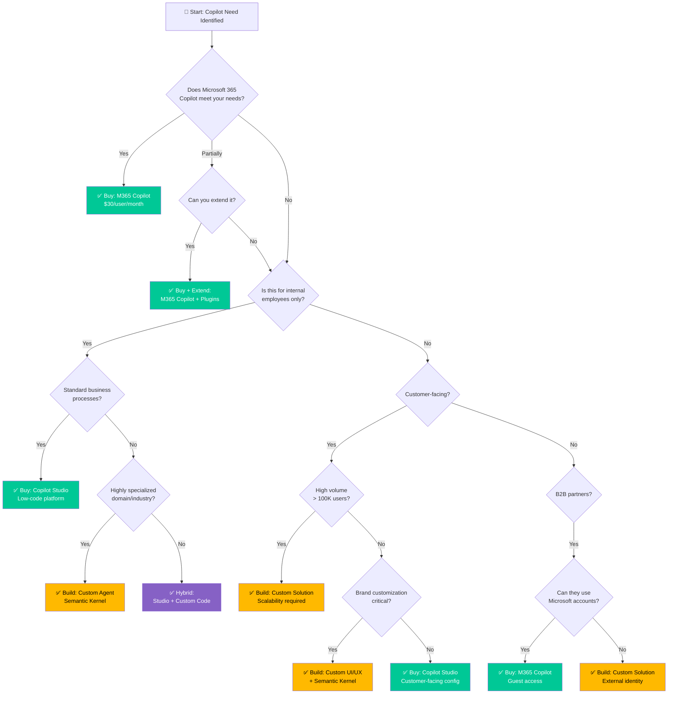

# Decision Tree: Build vs Buy

> **Should you build a custom solution or use out-of-the-box Copilot?**

---

## Decision Flowchart



---

## Quick Assessment Matrix

| Factor | Buy (M365 Copilot) | Buy (Copilot Studio) | Build (Custom) |
|--------|-------------------|---------------------|----------------|
| **Time to Deploy** | Immediate | Days-Weeks | Months |
| **Cost (Year 1)** | $30/user/month | $200/month + usage | $100K-500K |
| **Customization** | Limited | Moderate | Unlimited |
| **Maintenance** | Microsoft | Low (no-code) | High (dev team) |
| **Scalability** | Excellent | Good | Depends |
| **Control** | Low | Medium | Full |
| **Skills Required** | None | Power Platform | C#/Python |
| **Best For** | Standard workflows | Internal automation | Complex/unique |

---

## Option 1: Buy - Microsoft 365 Copilot

### When to Choose

✅ **Choose M365 Copilot if:**
- Standard Microsoft 365 apps usage (Word, Excel, Outlook, Teams)
- Knowledge workers doing common tasks
- Want immediate value with zero development
- Budget available ($30/user/month)
- Users already have M365 E3/E5 licenses
- Acceptable to use Microsoft's roadmap

❌ **Don't choose if:**
- Need industry-specific functionality
- Require custom integrations with non-M365 systems
- Customer-facing use cases
- Budget constraints (high per-user cost)
- Need granular control over AI behavior

### What You Get

**Built-in Capabilities:**
- Chat with your data (Word, Excel, PowerPoint, Outlook, Teams)
- Meeting summaries and action items
- Email drafting and summarization
- Document creation from prompts
- Data analysis in Excel
- PowerPoint slide generation
- Teams meeting recap

**Extensibility:**
- Microsoft Graph connectors (bring external data)
- Copilot plugins (custom skills)
- API integrations via Power Platform

### Cost Breakdown

```
Licensing: $30/user/month
Requirements: Microsoft 365 E3/E5 ($36-$57/user/month)

Total: $66-$87/user/month

For 100 users: $6,600-8,700/month = $79K-104K/year
For 1,000 users: $66,000-87,000/month = $792K-1.04M/year
```

### Implementation Timeline

```
Week 1: Licensing and enablement
Week 2-3: User training and rollout
Week 4+: Ongoing adoption support

Total: 1 month to full deployment
```

---

## Option 2: Buy - Copilot Studio

### When to Choose

✅ **Choose Copilot Studio if:**
- Need custom conversational agents
- Internal use cases (employees, not customers)
- Power Platform team available
- Want low-code/no-code development
- Need custom integrations with internal systems
- Rapid iteration and testing required
- Cost-sensitive (lower than M365 Copilot per-user cost)

❌ **Don't choose if:**
- Highly complex business logic
- Need full programmatic control
- Real-time processing with sub-second latency
- Custom ML models required
- High-scale customer-facing (> 100K users)

### What You Get

**Capabilities:**
- Visual conversation designer
- Generative answers (powered by Azure OpenAI)
- 500+ pre-built connectors
- Power Automate integration
- Multi-channel deployment (Teams, Web, Mobile)
- Testing and analytics tools
- Knowledge base integration (SharePoint, websites)

### Cost Breakdown

```
Copilot Studio Plan:
  - $200/month per tenant (up to 10 agents)
  - Additional agents: $20/agent/month
  - Conversations: $0.01 per conversation

Azure OpenAI (usage-based):
  - GPT-4: $0.03/1K input tokens, $0.06/1K output tokens
  - Typical conversation: 2K tokens = $0.12

Estimated Monthly Cost:
  Small (500 users, 2K conversations): $200 + $240 (OpenAI) = $440
  Medium (5K users, 20K conversations): $400 + $2,400 = $2,800
  Large (50K users, 200K conversations): $1,200 + $24,000 = $25,200

Much lower per-user cost than M365 Copilot!
```

### Implementation Timeline

```
Week 1: Environment setup and requirements
Week 2-3: Agent development and testing
Week 4: Integration with backend systems
Week 5-6: User acceptance testing
Week 7-8: Deployment and training

Total: 2 months to production
```

---

## Option 3: Build - Custom Solution

### When to Choose

✅ **Choose Custom Build if:**
- Highly specialized domain or industry
- Complex business logic that can't be no-code
- Need full control over AI behavior and prompts
- Customer-facing with high volume (> 100K users)
- Unique competitive advantage from AI
- Existing development team and infrastructure
- Integration with legacy or proprietary systems
- Strict security/compliance beyond standard controls

❌ **Don't choose if:**
- Standard use cases that Copilot Studio handles
- Limited development resources
- Need quick time-to-market (< 3 months)
- Budget constraints (high initial investment)

### What You Build

**Components:**
- Custom conversation management
- Azure OpenAI integration (Semantic Kernel)
- Backend services and APIs
- Data integration layer
- Authentication and security
- Monitoring and analytics
- CI/CD pipeline
- Testing framework

### Cost Breakdown

```
Development (One-Time):
  - Architecture and design: $20K-50K
  - Development (3-6 months): $100K-300K
  - Testing and QA: $20K-50K
  - Security audit: $10K-30K
  Total: $150K-430K

Annual Operating Costs:
  - Azure infrastructure: $500-5,000/month
  - Azure OpenAI: $2,000-50,000/month (usage-based)
  - Maintenance (dev team): $5K-20K/month
  - Monitoring and support: $500-2,000/month
  Total: $96K-876K/year

3-Year TCO: $450K-3M
```

### Implementation Timeline

```
Month 1-2: Architecture and design
Month 3-5: Development and integration
Month 6: Testing and security review
Month 7-8: Pilot deployment
Month 9: Production rollout

Total: 9 months to full production
```

---

## Decision Framework

### Calculate Your ROI

**M365 Copilot:**
```
Cost per user: $30/month
Break-even: User must save 1-2 hours/month
Value: Immediate productivity gains
Risk: Limited customization
```

**Copilot Studio:**
```
Cost per user: $0.50-5/month (depending on usage)
Break-even: System must replace manual work or other tools
Value: Custom workflows, cost-effective at scale
Risk: Limited to Power Platform capabilities
```

**Custom Build:**
```
Cost per user: $2-20/month (amortized over 3 years)
Break-even: Must deliver unique competitive advantage
Value: Unlimited customization, proprietary IP
Risk: High upfront cost, development complexity
```

### Risk Assessment

**Low Risk → Buy**
- Proven use case
- Standard requirements
- Fast time-to-value needed
- Limited budget

**Medium Risk → Extend/Hybrid**
- Mostly standard with some custom needs
- Can start with buy, extend later
- Balanced approach

**High Risk → Build**
- Unproven use case
- Significant investment
- Long payback period
- Requires ongoing development

---

## Hybrid Strategies

### Start Small, Scale Smart

**Phase 1: Buy (Months 1-3)**
- Deploy M365 Copilot or Copilot Studio
- Validate use cases
- Gather user feedback
- Measure ROI

**Phase 2: Extend (Months 4-6)**
- Add plugins/connectors where needed
- Custom APIs for specific functionality
- Still leveraging platform

**Phase 3: Build (Months 7-12)**
- Move complex scenarios to custom code
- Keep simple scenarios in platform
- Best of both worlds

### Build for Differentiation, Buy for Commodity

**Buy:**
- Meeting summaries
- Email drafting
- Document Q&A
- Standard helpdesk

**Build:**
- Proprietary business logic
- Industry-specific workflows
- Custom customer experiences
- Competitive differentiators

---

## Common Scenarios

### Scenario 1: Internal Knowledge Assistant

**Need:** Help employees find information in company knowledge base

**Recommendation:** **Buy - Copilot Studio**
- Use generative answers over SharePoint/web content
- Quick to deploy
- Low maintenance
- Cost-effective

---

### Scenario 2: Customer Support Chatbot

**Need:** 24/7 customer support for product questions

**If < 10K customers:** **Buy - Copilot Studio**
**If > 10K customers:** **Build - Custom Solution**

**Rationale:**
- High volume requires custom optimization
- Customer-facing needs brand customization
- Integration with ticketing systems

---

### Scenario 3: Specialized Industry Agent (Healthcare, Legal, Finance)

**Need:** Domain-specific AI with specialized knowledge

**Recommendation:** **Build - Custom Solution**
- Fine-tuned models on domain data
- Strict compliance requirements
- Custom terminology
- Competitive advantage

---

### Scenario 4: Employee Productivity (Standard Office Work)

**Need:** Help with emails, documents, meetings

**Recommendation:** **Buy - M365 Copilot**
- Out-of-the-box value
- No development needed
- Proven ROI
- Microsoft roadmap improvements

---

## Total Cost of Ownership (3 Years)

### Small Company (100 users)

**M365 Copilot:**
```
Year 1: $79K-104K
Year 2: $79K-104K
Year 3: $79K-104K
Total: $237K-312K
```

**Copilot Studio:**
```
Year 1: $5K-15K
Year 2: $5K-15K
Year 3: $5K-15K
Total: $15K-45K
Winner for cost: ✅ Copilot Studio
```

**Custom Build:**
```
Year 1: $150K-430K (development) + $96K (ops) = $246K-526K
Year 2: $96K
Year 3: $96K
Total: $438K-718K
Only justified if delivering unique value
```

---

### Large Company (10,000 users)

**M365 Copilot:**
```
Year 1: $7.9M-10.4M
Year 2: $7.9M-10.4M
Year 3: $7.9M-10.4M
Total: $23.7M-31.2M
Expensive at scale!
```

**Copilot Studio:**
```
Year 1: $50K-150K
Year 2: $50K-150K
Year 3: $50K-150K
Total: $150K-450K
Winner for cost: ✅ Copilot Studio
```

**Custom Build:**
```
Year 1: $250K-500K (development) + $400K (ops) = $650K-900K
Year 2: $400K
Year 3: $400K
Total: $1.45M-1.7M

Per-user (3 years): $48-57 vs M365 Copilot $790-1,040
Winner at scale: ✅ Custom Build (if justified)
```

---

## Red Flags: When NOT to Build

❌ **Don't build if:**
- "Not invented here" syndrome (ego-driven)
- Underestimating complexity
- No ongoing development budget
- Timeline pressure (need it in < 3 months)
- Haven't validated with buy/extend first
- Small user base (< 1,000 users)
- Standard use case that products handle

---

## Green Lights: When to Build

✅ **Do build if:**
- Proven ROI from pilot (tried buy/extend first)
- Unique competitive advantage
- High user volume (custom more cost-effective)
- Specific compliance requirements
- Strategic capability (not just tactical)
- Dedicated team and budget
- Long-term commitment (3+ years)

---

## Decision Checklist

**Answer these questions honestly:**

### Business Questions
- [ ] Is this a core competency or differentiator? (Build)
- [ ] Is this a commodity function? (Buy)
- [ ] What's the opportunity cost of building? (Time to market)
- [ ] Can we buy and extend later if needed? (De-risk)

### Technical Questions
- [ ] Do standard products meet 80%+ of needs? (Buy)
- [ ] Do we have in-house AI/ML expertise? (Build)
- [ ] Can we maintain custom code long-term? (Build risk)
- [ ] Are integrations available out-of-the-box? (Buy)

### Financial Questions
- [ ] What's our budget? (< $100K → Buy, > $100K → Can consider build)
- [ ] What's the 3-year TCO? (Calculate above)
- [ ] What's the expected ROI? (Must be 3x+ for build)
- [ ] Can we afford to fail? (Buy = lower risk)

### Organizational Questions
- [ ] Do we have a development team? (Build requirement)
- [ ] What's our risk tolerance? (Buy = lower risk)
- [ ] Can we move fast with buying? (Faster time-to-value)
- [ ] Is this strategic for 5+ years? (Build justification)

---

## Recommended Approach

### For 90% of Organizations: **Start with Buy**

**Step 1:** Try M365 Copilot or Copilot Studio (1-3 months)
**Step 2:** Measure ROI and identify gaps
**Step 3:** Extend with plugins/APIs where needed (months 4-6)
**Step 4:** Only build if clear ROI and strategic importance (months 7+)

**Rationale:**
- De-risk the investment
- Learn what works before committing
- Faster time-to-value
- Can always build later

---

## Real-World Examples

### Company A: Mid-size SaaS Company (500 employees)
**Choice:** Copilot Studio
**Why:** Internal helpdesk and knowledge base, no custom requirements
**Result:** $5K/month, 80% ticket deflection, ROI in 2 months

### Company B: Global Bank (15,000 employees)
**Choice:** Hybrid (M365 Copilot + Custom for Trading)
**Why:** Standard productivity + specialized trading agents
**Result:** $12M annual value (see case study)

### Company C: Legal Tech Startup (50 employees)
**Choice:** Build - Custom Solution
**Why:** Core product differentiator, fine-tuned legal AI
**Result:** Raised Series A based on proprietary AI

---

## Get Expert Guidance

**Need help deciding?**

**Free Resources:**
- [Architecture Decision Guide](../../docs/getting-started/for-architects.md)
- [ROI Calculator](../roi-calculator.md)
- [Case Studies](../../docs/case-studies/)

**Professional Services:**
- Strategy Sprint: $15,000 (1 day)
- Architecture Design: $25,000 (2-3 days)
- Full Assessment: Custom pricing

[Book Consultation](mailto:ram@aicapabilitybuilder.com)

---

## Summary: Start Here

**If you're unsure, use this simple rule:**

1. **Try M365 Copilot first** (if you have M365)
   - 30-day pilot
   - Measure actual usage and value
   - Decide based on data

2. **If M365 doesn't fit, try Copilot Studio**
   - 60-day pilot with 1-2 agents
   - Test integration capabilities
   - Validate with users

3. **Only build if:**
   - You tried 1 and 2 and they don't work
   - You have clear ROI (> $500K annual value)
   - You have team and budget
   - It's strategic (3+ years)

**Most organizations should never build.** The out-of-the-box solutions are incredibly powerful.

---

[← Back to Decision Trees](./README.md) | [View Agent Type Selection →](./agent-type-selection.md)
